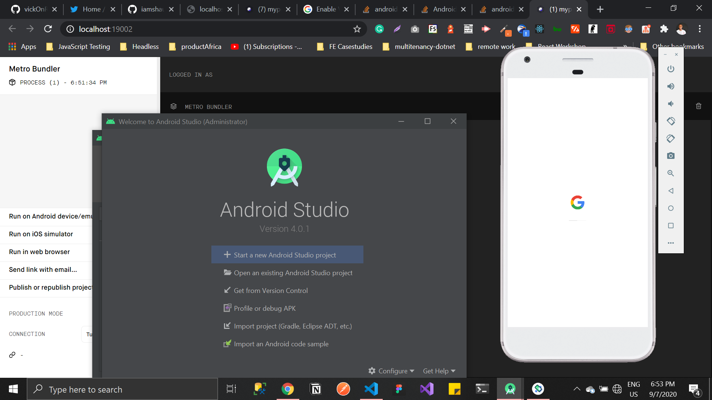

# Day 01

**Date**: 7th Sept, 2020
**Time spent**: 4

## Summary of yesterday

Nothing

## Learnings

- There are 2 ways to create a react native app

  - **Expo CLI**: Expo provides us a wrapper for compiling and previewing our app without necessarily setting up Android Studio or XCode. It's great to start with, but you'll have to eject to access more advanced react native features.

  - **React Native CLI**: Full setup for working with react native. Requires installing Android Studio or XCode.

    <!-- prettier-ignore -->

  

### Styling React Native

- React Native gives us a css-like way to style our components. If you've used css modules, things should look very familiar. Except with the following differences

  - Property names are camelCase in react native.
  - Component styles are separated by commas.
  - We create styles with `StyleSheet.create({})` inside the component file.
  - Styles are scoped to components by default.
  - Styling does not cascade and there is no inheritance except for `<Text>` inside of `<Text>` components.

- React Native `Views` aren't scroll by default. We need to use the `<ScrollView>` react native component for views that are scrollable.
- **Lists in React Native**: React native lists are rendered in many ways

  - <FlatList>: Flatlists render items lazily
  - <SectionList>: Scrollview renders all the children elements at once.
  - <ScrollView>: Used for rendering sectioned lists items

  ```js
  <FlatList
    data={people}
    renderItem={({ item }) => <Text style={styles.item}>{item.name}</Text>}
  />
  ```

  - The `FlatList` component can be passed in a few other props like
    - **numColumns**: Arranges the items in number of columns specified
    - **keyExtractor**: Specifies the property to use as the key for all top level list items. The default is the `key` prop.

  ```js
  <FlatList
    keyExtractor={(item) => item.useThisAsKey}
    numColumns={2}
    data={people}
    renderItem={({ item }) => <Text style={styles.item}>{item.name}</Text>}
  />
  ```

  Good stuff, anyways

## Challenges

- **Enable VT-x in your BIOS security settings**:

  - I spent a few minutes learning about BIOS settings. BIOS controls communication between system devices. In this case, it was preventing Android studio from launching. Learn more [here](https://www.lifewire.com/bios-basic-input-output-system-2625820).
  - **fix**: I fixed this error by enabling virtualization on my PC. This is device specific, but here's a [few](https://stackoverflow.com/questions/39542853/enable-vt-x-in-your-bios-security-settings-refer-to-documentation-for-your-comp) [helpful](https://stackoverflow.com/questions/42471855/android-studio-enable-vt-x-in-your-bios-setting) [resources](https://stackoverflow.com/questions/40342015/enable-vt-x-in-your-bios-security-settings-ensure-that-your-linux-distro-has-wo).

## Tomorrow's focus

- Flexbox for react native
- Custom fonts
- React navigation
