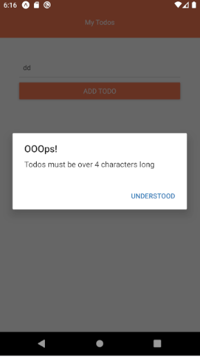
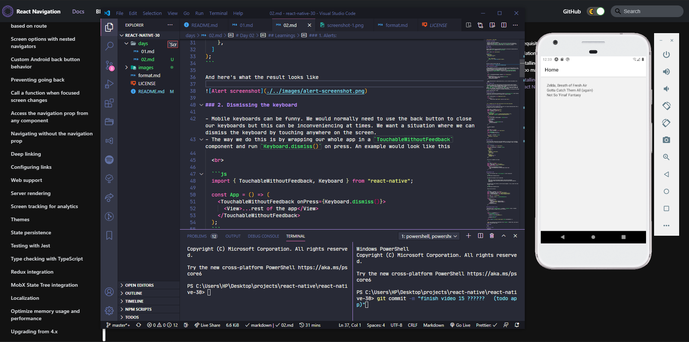

# Day 02

**Date**: 18th Sept, 2020
**Time spent**: 3hours

## Summary of yesterday

- Started a react native tutorial
- Setup my environment (Android studio, etc) and built my first app with Expo-cli
- Explored lists (`<FlatList/>`, `<SectionList/>` & `<ScrollView>`) in React Native
- Fixed VT-x settings preventing Android studio from running on my machine

## Learnings

### 1. Alerts:

Alerts in React Native are very different from alerts on the web. We create alerts by importing the `Alert` component from `react-native`

```js
import { Alert } from "react-native";

// usage
Alert.alert(
  "Alert Title",
  "Description of Alert",
  // Actions or CTAs
  [
    {
      text: "Understood",
      onPress: () => console.log("Alert Closed"),
    },
  ]
);
```

And here's what the result looks like



### 2. Dismissing the keyboard

- Mobile keyboards can be funny. We would normally need to use the back button to close our keyboards but this can be inconveniencing at times. We want a situation where we can dismiss the keyboard by touching anywhere on the screen.
- The way we do this is by wrapping our whole app in a `TouchableWithoutFeedback` component and run `Keyboard.dismiss()` on press. An example would look like this

  <br>

  ```js
  import { TouchableWithoutFeedback, Keyboard } from "react-native";

  const App = () => (
    <TouchableWithoutFeedback onPress={Keyboard.dismiss()}>
      <View>...rest of the app</View>
    </TouchableWithoutFeedback>
  );
  ```

  I don't know how much of a good practice this is, but it solves the problem at the moment.

### 3. Flexbox in RN



- All items in RN are flex items and take up the whole horizontal space by default
- Elements by default have a collapsed height. But adding giving them the property of `flex: 1` makes them span the available vertical space
- The `flexDirection` property positions items opposite from the way the web does. The default `flex` value is `row` on the web and `column` on RN. I really don't understand why, but lets just hope it gets easier to wrap my head around.
- `column` value positions elements as horizontal on RN but does so vertically on the web

[Graphic explaining what I mean]

### React Native Icon

- Using expo to bootstrap our app gives us access to `@expo/vector-icons` which contains virtually any icon we can think of. We make use of them as follows

  ```js
  import { MaterialIcons } from "@expo/vector-icons";

  const App () => {
      return (
          <MaterialIcons name="delete" size={25} color="blue"/>
      )
  }

  ```

> PS. I rounded up my first react native app for this course using expo

### Adding Custom Fonts to a RN Project

- We use fonts in RN by including the font files in our app and requiring them. Here is an example of how to use custom fonts in RN

  ```js
  import React, { useState } from "react";
  import * as Font from "expo-font";
  import { AppLoading, Text } from "expo";

  const getFonts = () =>
    Font.loadAsync({
      "nunito-regular": require("./assets/fonts/Nunito-Regular.ttf"),
      "nunito-bold": require("./assets/fonts/Nunito-Bold.ttf"),
    });

  const App = () => {
    const [fontsLoaded, setFontsLoaded] = useState(false);

    if (fontsLoaded) {
      return <Home />;
    } else {
      <AppLoading
        onFinish={() => setFontsLoaded(true)}
        startAsync={getFonts}
      />;
    }
  };
  ```

  In another component
  <br/>

  ```js
  import React from "react";
  import { Text, StyleSheet } from "react-native";

  const SomeComponent = () => {
    return <Text>Random Text</Text>;
  };

  const styles = StyleSheet.create({
    text: {
      fontFamily: "nunito-bold",
    },
  });
  ```

### Global Styles

- We can add global styles that can be used anywhere in our app. This isn't different from the normal way of defining stylesheets, it's just more modular. Here's an example

  ```js
  // globalStyles.js

  import { StyleSheet } from "react-native";

  export const globalStyles = StyleSheet.create({
    container: {
      flex: 1,
      padding: 24,
    },
    titleText: {
      fontFamily: "nunito-bold",
      fontSize: 18,
      color: "#333",
    },
    paragraph: {
      marginVertical: 20,
      lineHeight: 20,
    },
  });
  ```

  We can use it anywhere in our app

  ```js
  // home.js

  import React from "react";
  import { Text, View } from "react-native";
  import { globalStyles } from "../styles/global";
  export default function Home() {
    return (
      <View style={globalStyles.container}>
        <Text style={globalStyles.titleText}>Home Screen</Text>
      </View>
    );
  }
  ```

### Navigation in RN

- Install the following to get `react-navigation` to work (using yarn)

  ```bash
  yarn add @react-navigation/native
  ```

  Also add the following if you're using expo

  ```bash
     expo install react-native-gesture-handler react-native-reanimated react-native-screens react-native-safe-area-context @react-native-community/masked-view
  ```

  The easiest way to get started is with the stack navigator. To use, install the stack navigator library

  ```bash
  yarn add @react-navigation/stack
  ```

  Then we can use like so

  ```js
  // App.js
  import React, { useState } from "react";
  import { StyleSheet, Text, View } from "react-native";
  import { NavigationContainer } from "@react-navigation/native";
  import { createStackNavigator } from "@react-navigation/stack";

  import Home from "./screens/home";

  const { Navigator, Screen } = createStackNavigator();

  const App = () => {
    return (
      <NavigationContainer>
        <Navigator>
          <Screen name="Home" component={Home} />
          <Screen name="About" component={About} />
        </Navigator>
      </NavigationContainer>
    );
  };
  ```

### Navigating between screens

- Each child of the `<Stack.Navigator>` is passed a `navigation` props. It enables declarative routing in RN apps. We can use it like so.

  <br/>

  ```js
  const App = ({ navigation }) => {
    const pressHandler = () => {
      // move to the specified page
      navigation.navigate("ReviewDetails");

      // move to your village
      navigation.goBack();
    };

    return <Button title="go to reviews page" onPress={pressHandler} />;
  };
  ```

  **NB**: All screens must be registered in the `Navigator`. Without that, your app can cannot reference those views.

## Challenges

- None

## Tomorrow's focus

- Navigation
- Form Validation
