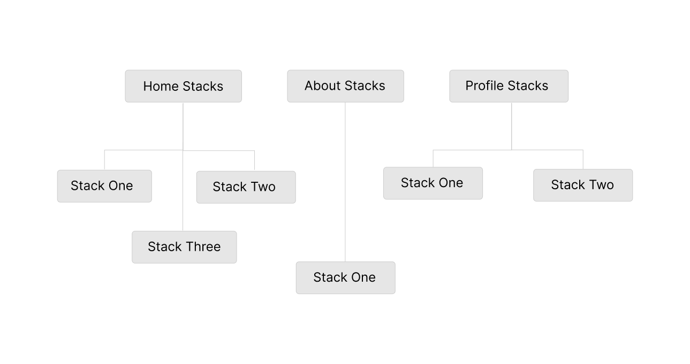

# Day 03

**Date**: 9th Sept, 2020
**Time spent**: 2 hours

## Summary of yesterday

- Learned about `Alerts` in react native & dismissing the keyboard
- Learned about Flexbox
- Added custom fonts to RN project
- Learned to use global styles
- Learned about setting up navigation with `react-navigation` in RN

## Learnings

### Passing data between routes

- We send data to other routes by passing a second argument to the `navigation.navigate()` function. We can then read these values in the component by calling `props.route.params.value`.

  ```js
  // In App.js
  const values = {
    name: "Random name",
    age: 20,
  };

  const App = ({ navigation }) => (
    <View>
      <Button
        onPress={() => navigation.navigate("NextScreen", values)}
        title="Navigate Away"
      />
    </View>
  );
  ```

  And in `NextScreen.js`

  ```js
  const NextScreen = ({ route }) => {
    const { name, age } = route.params;
    return (
      <View>
        <Text>{`Hey my name is ${name} and I'm ${age} years old`}</Text>
      </View>
    );
  };
  ```

### Screen Options

- We can customize our screens with the `options` prop. We can do this individually and at the root of our `<Navigator>`.

  ```js
  const { Navigator, Screen } = createStackNavigator();

  const App = () => (
    <View>
      <NavigationContainer>
        // These styles will
        <Navigator screenOptions={{
          headerStyle: { backgroundColor: "red" } }
        }>
            <Screen name="Home" component={Home}>
            // But this will override the previously set one
            <Screen name="About" component={About}  options={
                {
                    headerStyle: {
                        backgroundColor: "red"
                        }
                    }
                }>
        </Navigator>

      </NavigationContainer>
    </View>
  );
  ```

## Drawer Navigation

- Unlike Stack navigation, Drawer navigation does not push/pop items into the navigation stack. It totally replaces them. We can have multiple draw navigation children which can be stack navigation containers. We can think of them like this



- We implement drawer navigation by wrapping the various stack navigation parents in a single drawer navigation.
  <br>

  ```js
  // drawer.js
  import React from "react";
  import { createDrawerNavigator } from "@react-navigation/drawer";
  // HomeStack and AboutStack are parent stack navigation components
  import HomeStack from "./homeStack";
  import AboutStack from "./aboutStack";

  const { Navigator, Screen } = createDrawerNavigator();

  export default function RootDrawerNavigator() {
    return (
      <Navigator>
        <Screen name="Home" component={HomeStack} />
        <Screen name="About" component={AboutStack} />
      </Navigator>
    );
  }
  ```

### Customizing the Header

- We can supply the `options` props to a `Screen` component to customize how the header appears
  <br>

  ```js
  ...
  return (
    <Navigator>
      <Screen
        name="Home"
        component={HomeStack}
        options={{
          header: HeaderComponent,
        }}
      />
      <Screen
        name="About"
        component={AboutStack}
        options={{
          header: HeaderComponent,
        }}
      />
    </Navigator>
  );
  ...
  ```

### Images in RN

- RN gives us an `Image` component for images. All we need to do is provide the `source` prop with a `require` statement containing the path to the image.
- We can also have background images in RN. The component to use is the `ImageBackground` component. We still have to provide the `source` prop.
  <br/>

  ```js
  import { Image, ImageBackground } from "react-native";

  const App = () => (
    <View>
      <ImageBackground source={require("../pathToImage")}>
        <View>....</View>
      </ImageBackground>
      <Image source={require("../pathToImage")} />
    </View>
  );
  ```

## Challenges

- Had lots of issues with expo and my emulator. I had to restart over and over for it work. I hope to stop experiencing this problem when I use react-native-cli.

## Tomorrow's focus

- Finish up JSNinja's React Native tutorial
- Find another more indepth RN tutorial
- Read a few articles on React Native performance
