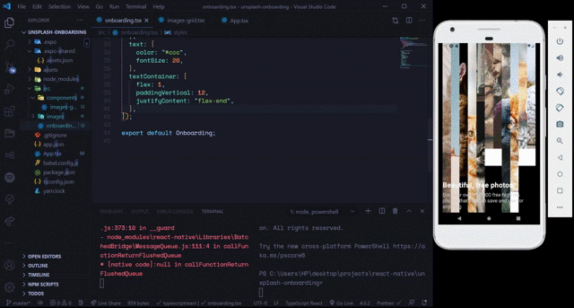

# Day 09

**Date**: 9th Sept, 2020
**Time spent**: 3 hours

## Summary of yesterday

- Learned how to use the `scrollView` component
- Used `transform` and `translate` in react-native.

## Learnings

- Today, I decided to try my hands on making coding a UI in react-native without following any tutorials. I have a few screenshots of the Unsplash onboarding experience. Let's see how this goes 🛠

After about an hour, [here's what I came up with](https://github.com/vickOnRails/react-native-unsplash-onboarding). Unfortunately, I couldn't finish it today, maybe I'll continue tomorrow

## Challenges

- None

## Tomorrow's focus

- Continue with the [React Native Fashion](https://www.youtube.com/playlist?list=PLkOyNuxGl9jyhndcnbFcgNM81fZak7Rbw) UIKit
- Continue with the [Unsplash Onboarding Screens](https://github.com/vickOnRails/react-native-unsplash-onboarding) UI to React Native
