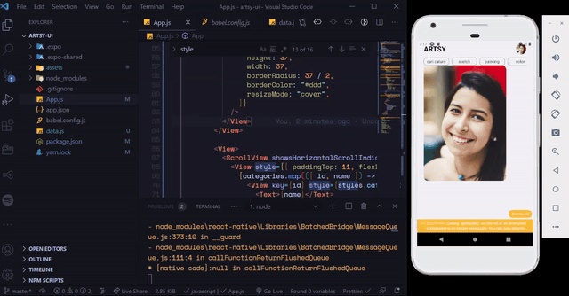

# Day 11

**Date**: 17 Sept, 2020
**Time spent**: 1hour

## Summary of yesterday

- Added images to the React Native Fashion app onboarding slider
- Learned about restyle, which is a styling library for React Native from Shopify

## Learnings

I replicated a screen from the Artsy app following this [youtube](https://www.youtube.com/watch?v=ZbRZM750xpg) tutorial. The common truth is that it's easier to work on something from scratch than to finish up old projects 🙈. I was very tired today and decided to go with something simple and familiar. I found this video on [Youtube](https://www.youtube.com/watch?v=ZbRZM750xpg) and followed through. Nothing new anyways 🤷🏾‍♀️. Here's what I made.

It's not so great, but it was done in under 40 mins.

- You can learn more about `react-native-snap-carousel` [here](https://github.com/archriss/react-native-snap-carousel).

## Challenges

- My major challenge has been time to dedicate to the exercise. The idea situation is 2 hours daily, but I could barely count an hour today. I hope this gets better.

## Tomorrow's focus

- I'll finish this tomorrow
